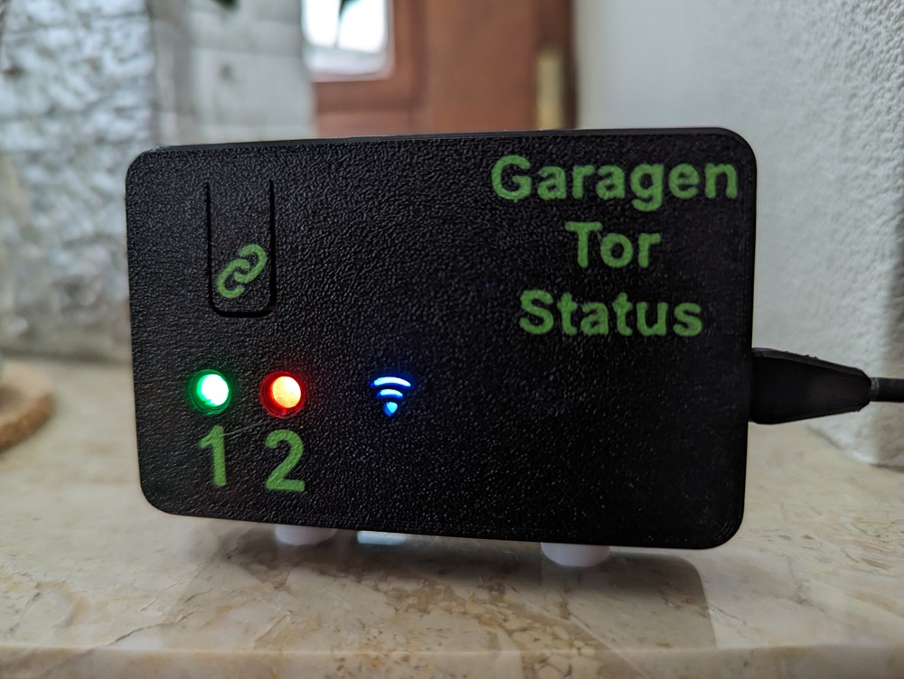
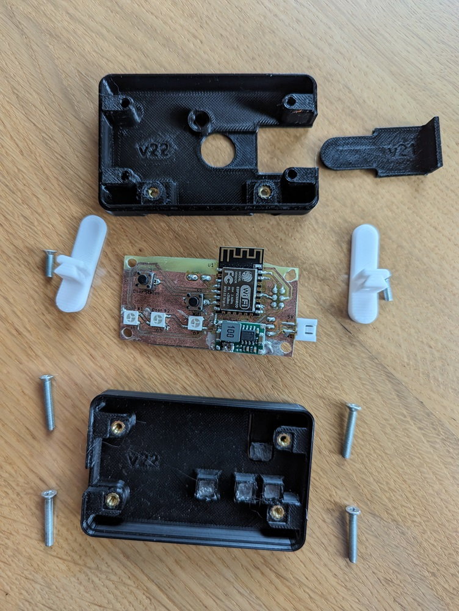
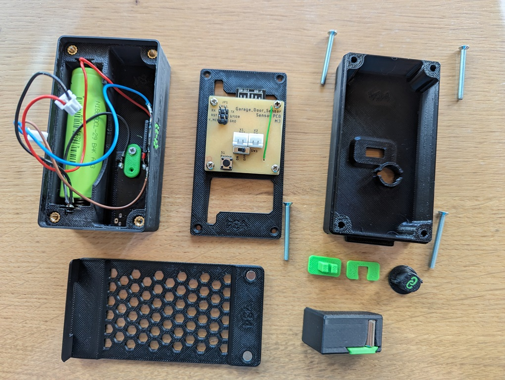

# Garage Door Sensor

This is a project to send the status of multiple garage doors (or equal) to one indoor station. This is useful if the door can't be seen from inside.
Each device (sensor and indoor station) uses an ESP12-F (ESP8266) controller that runs the software and is the WiFi transmitter. The data between the sensor and the indoor station is transmitted using ESP-Now. The indoor station acts as a gateway between ESP-Now and WiFi.

## Building the Indoor Station
You need to build only one indoor station. It receives the state of all door sensors. The current version of the indoor station is capable of displaying 2 sensors at the same time. If you need more sensors, the indoor station must be adapted.

### PCBs and Housing
The PCBs are designed using Autodesk Fusion360 to be manufactured with toner transfer method. All design files are located in the [Electrical files for IndoorStation](IndoorStation/Electrical) subfolder.

The housing parts are also designed using Autodesk Fusion360 to be manufactured with a 3D printer. All files are located in the [Mechanical files for IndoorStation](IndoorStation/Mechanical) subfolder. Each part is needed once except the Stand (needed twice).

Also the following additional parts are necessary:
- 4x Screw M3x20
- 2x Screw M3x10
- 6x Heat Insert M3x5x5
- some acrylic glass to cover and diffuse the LEDs
- DC Power Supply (voltage e.g. 5V, is regulated down to 3.3V)

The following image shows all parts of the IndoorStation:

### Software
The software files are located in the [Software files for IndoorStation](IndoorStation/Software) subfolder.

To build and flash the lastest software to the IndoorStation ESP12-F download and install Visual Studio Code and install the PlatformIO extension. The following page explains the whole process: https://randomnerdtutorials.com/vs-code-platformio-ide-esp32-esp8266-arduino/

The following parts must be flashed:
- Firmware: Use the `Build` and `Upload` PlatformIO tasks.
- Filesystem (containing the website files): Use the `Build Filesystem Image` and `Upload Filesystem Image` PlatformIO tasks.

Use the `Monitor` PlatformIO task to view the output messages at startup and note the MAC address. This is later needed before compiling the sensor firmware.

## Building the Sensor
You need to build one sensor per door to monitor. The current version of the indoor station is capable of displaying 2 sensors at the same time. If you need more sensors, the indoor station must be adapted. No changes to the sensor are necessary.
### PCBs and Housing
The PCBs are designed using Autodesk Fusion360 to be manufactured with toner transfer method. All design files are located in the [Electrical files for sensor](Sensor/Electrical) subfolder.

The housing parts are also designed using Autodesk Fusion360 to be manufactured with a 3D printer. All files are located in the [Mechanical files for sensor](Sensor/Mechanical) subfolder. Each part is needed once.

Also the following additional parts are necessary:
- 4x Screw M3x30
- 4x Heat Inserts M3x5x5
- 1x Li-Ion 18650 (e.g. https://www.roboter-bausatz.de/p/bak-18650-lithium-ionen-akku-2900mah-3-6v-3-7v-erhoehter-pluspol)
- 1x Charge Modul USB-C (e.g. https://www.roboter-bausatz.de/p/lithium-batterie-lademodul-usb-c-ip2312-4-2v-5v)
- 2x Magnet for Door Mount

The following image shows all parts of the Sensor:

### Software
The software files are located in the [Software files for Sensor](Sensor/Software) subfolder.

To build and flash the lastest software to the sensor ESP12-F download and install Visual Studio Code and install the PlatformIO extension. The following page explains the whole process: https://randomnerdtutorials.com/vs-code-platformio-ide-esp32-esp8266-arduino/

Before building and flashing the software, follow the instructions in the [`addresses_Template.h`](Sensor/Software/include/addresses_Template.h) file. It is necessary to build the IndoorStation first to get the MAC address of the IndoorStation ESP12-F!

Use the `Monitor` PlatformIO task to view the output messages at startup and note the MAC address. This is later needed for sensor pairing (e.g. create a sticker with the MAC address on the back of the sensor housing).

## Usage
This chapter describes the basic usage of the indoor station and sensor. It is necessary to build at least one device each before proceding.
### Charging the sensor
Switch off the sensor via the switch on the back side and connect it to an USB-C charger. Make sure the charger is capable of delivering enough energy. Otherwise the charging process will be slow.

Charger LED states:

|LED		|Meaning		|
|---------------|-----------------------|
|Red solid	|Powered via USB-C	|
|Blue solid	|Charging complete	|

### WiFi Setup
The indoor station isn't yet connected to your local WiFi the first time you use it or after a reset.
It is necessary to connect it to the WiFi. Otherwise the following steps can't be done and the indoor station can't receive the sensor messages.
1. Power the indoor station.
2. The WiFi LED will start flashing blue for about 5 seconds (indicating that it's trying to set up a connection).
3. After this timeout, the WiFi LED will change to white, indicating that the indoor station entered access point configuration mode.
4. Search for all available WiFi networks with your smartphone or computer and connect to the one called "Garagen Tor Status AP" (configuration access point).
5. After connecting to the configuration access point, a captive portal pops up automatically (sometimes needs some seconds; otherwise directly open the IP 192.168.4.1 in your browser).
6. Select your routers WiFi network and enter the password.
7. After confirmation, the indoor station restarts and the WiFi LED is flashing blue again until the connection to the router is established.
8. When successfully connected to the WiFi, the WiFi LED is solid blue.

### Pairing of the Sensor
The pairing of the sensor can be done via the pairing button of the indoor station and the pairing button of the corresponding sensor.
1. Press the pairing button on the indoor station long. The first sensor led will start to flash blue and red.
2. Press the pairing button on the indoor station short to select the sensor slot you want to pair.
3. When the indoor station mode for the correct sensor is pairing, press and hold the pairing button on the sensor for at least 5 seconds (sensor must be switched on).
4. If the pairing of the sensor was successful, the indoor station stopped to flash blue and red.

Repeat all steps for all sensors.

**Alternative:**

The pairing of the sensor can also be done via the web pages of the indoor station.
1. Open the web page (with one of the following ways):
   a) Enter the IP address that was assigned by your router in the address bar of your browser.
   b) For Fritz!Box: enter the following host name in the address bar of your browser: `garagen-tor-status.fritz.box`
2. Change to the configuration page (gear icon)
3. Enter the MAC address of the sensor to pair in the textbox of the corresponding sensor and click submit.
4. All messages of this sensor are now received for the sensor index where the MAC address was entered.

Repeat steps 3. and 4. for all sensors.

### Mounting the Sensor and Magnet
To mount the sensor and magnet to the garage door:
1. Insert a magnet inside the `Magnet_Mount` part and assemble the `Magnet_Mount_Lid` with a screw.
2. Take the full assembled sensor, the `Door_Mount` part and the `Magnet_Mount`.
3. Switch off the sensor using the switch on the back side.
4. Go inside the garage and close the door.
5. Fix the `Door_Mount` part with double sided tape or power stripes to the door frame. Make sure, there is a small gap of about 3 mm to the metal blade of the door (the outermost moving part). An example position is shown in the following pictures:
6. Insert the sensor in the `Door_Mount`. The two magnets on the `Door_Mount` hold the sensor in place. The counterparts are the two upper screws in the sensor housing.
7. Fix the `Magnet_Mount` part with double sided tape or power stripes to the door blade. Make sure, the magnet is near the icon on the side of the sensor (indicating the position of the reed switch).
8. Open and close the door to make sure, the magnet is moved from and to the sensor, without any mechanical contact. If the door is closed, the magnet must reside near the sensor again.
9. Remove the sensor from the `Door_Mount`, switch the sensor on using the switch on the back side and insert the sensor in the `Door_Mount` again.

  </img>
  </img>

### Testing
To test the whole system, open and close one garage door after another and monitor the displayed state on the indoor station.
- When the first door is closed, the LED "1" on the indoor station will be red.
- When the first door is open, the LED "1" on the indoor station will be green.
- When the second door is closed, the LED "2" on the indoor station will be red.
- When the second door is open, the LED "2" on the indoor station will be green.
- All actual door states can also be monitored via the web page (overview page). To open the the web page, follow the steps at the ["Pairing the sensor" chapter](#pairing-of-the-sensor).

## LED States
| Led		         | Color 	    | State    | Description						                                    |
|----------------|------------|----------|------------------------------------------------------------|
| Sensor #1 / #2 | red 		    | solid    | Door is closed, battery ok 				                        |
| Sensor #1 / #2 | red 		    | flashing | Door is closed, battery empty 				                      |
| Sensor #1 / #2 | green 	    | solid    | Door is open, battery ok 					                        |
| Sensor #1 / #2 | green 	    | flashing | Door is open, battery empty 				                        |
| Sensor #1 / #2 | purple 	  | solid    | Sensor mode is charging 					                          |
| Sensor #1 / #2 | red / blue	| blinking | Sensor mode is pairing 					                          |
| Sensor #1 / #2 | / 		      |  off     | Either no message received yet, or sensor mode is disabled |
| Wifi  	       | blue 	    | flashing | Trying to connect to WiFi 				                        	|
| Wifi  	       | blue 	    | solid    | Connected to WiFi 					                                |
| Wifi  	       | red 		    | solid    | Connection to WiFi failed 				                          |
| Wifi  	       | white 	    | solid    | Configuration access point is open 			                  |
| All  		       | yellow 	  | blinking | OTA Update is in progress 					                        |
| All  		       | green 	    | solid    | OTA Update is in ready 					                          |
| All  		       | red 		    | solid    | OTA Update is in failed 					                          |

## Button Reactions:
| Button  | Click Type  | Precondition                            | Description                                                                 |
|---------|-------------|-----------------------------------------|-----------------------------------------------------------------------------|
| Reset   | long press  | always                                  | Memory data and WiFi credentials are erased                                 |
| Pairing | long press  | no sensor is in pairing mode            | Set first sensor to pairing mode (start pairing)                            |
| Pairing | long press  | at least one sensor is in pairing mode  | Set all sensors that are in pairing mode back to normal mode (end pairing)  |
| Pairing | short click | no sensor is in pairing mode            | Do nothing                                                                  |
| Pairing | short click | at least one sensor is in pairing mode  | Find the first sensor with pairing mode. Set it to normal mode and set the next sensor to pairing mode. If it was the last sensor begin with the first again. |

## Sensor Modes
| Mode 		      | Description 													                                                                                                				|
|---------------|-----------------------------------------------------------------------------------------------------------------------------------------------|
| Normal	      | All messages are received, everything is saved, LED on								                                                                  			|
| Disabled	    | All messages are ignored, nothing is saved, LED off										                                                                    		|
| Charging	    | All messages are ignored, nothing is saved, LED in different color								                                                        		|
| Only Display  | Messages are only displayed via the LED, nothing is saved											                                                                |
| Pairing	      | Message from Indoor Station to corresponding sensor to configure the MAC address in the sensor, LED flashes red and blue, nothing is saved	  |

## Developer Hints
- The sensor is designed to consume as less power as possible. Therefore the ESP8266 on the sensor is only switched on when the pin state changed and only as long until the data is sent to the indoor station.
- The sensor trys to send the data on all available WiFi channels until success. The most common used channels are tried first.
- The indoor station can be updated using over the air (OTA) updates. The first time the firmware must be flashed via serial, the OTA is available by navigating to `garagen-tor-status.fritz.box/update` in the browser.